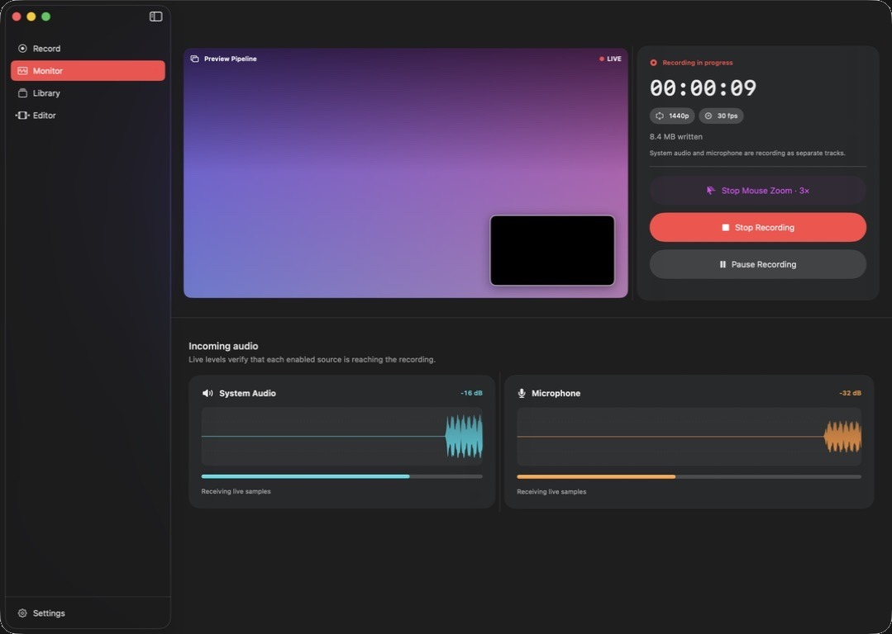
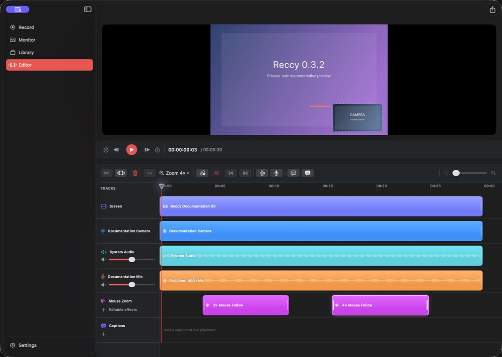
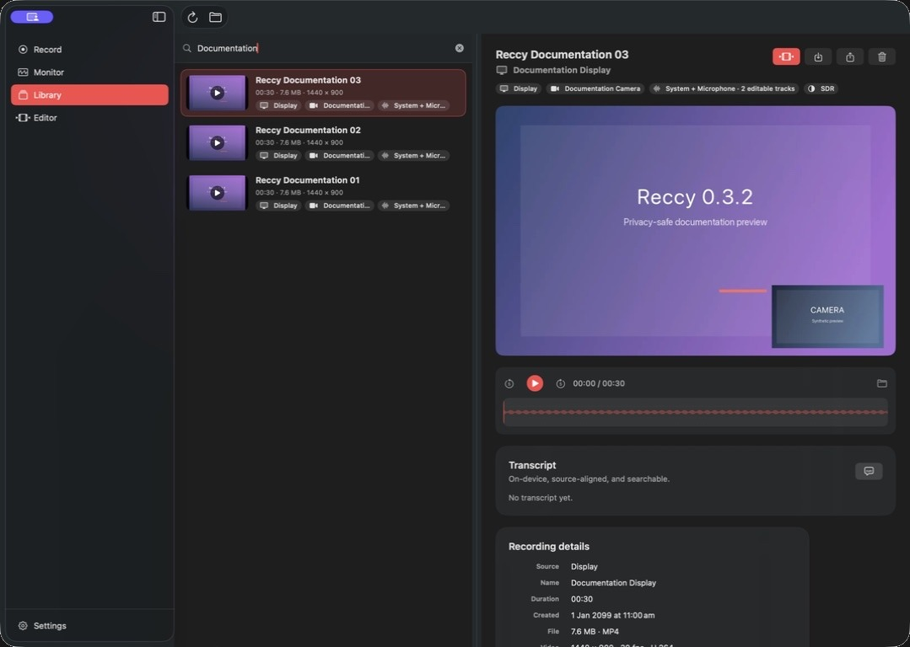
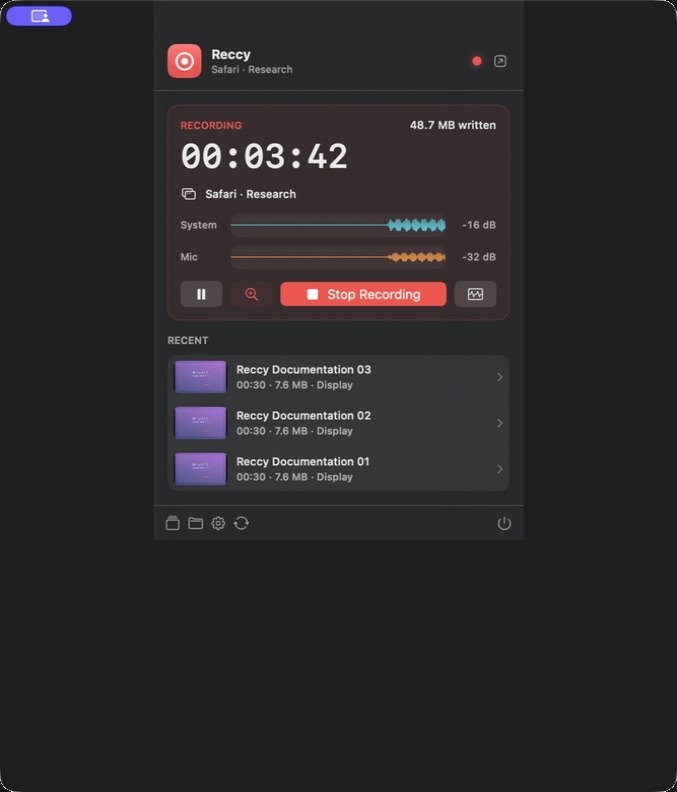
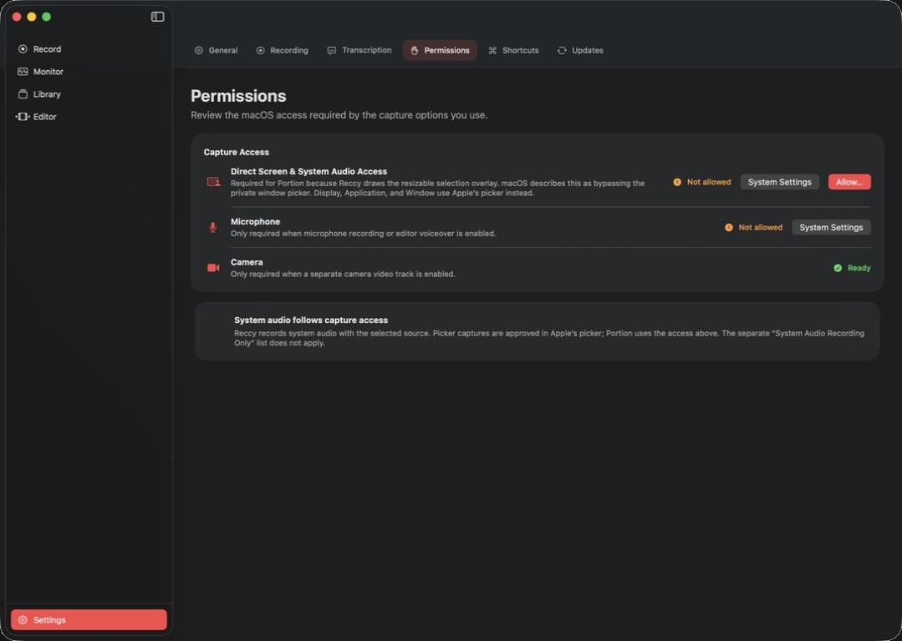

# Reccy

Reccy is a native screen recorder and non-destructive multitrack editor for macOS 26. It combines ScreenCaptureKit capture, an optional native camera track, separate system and microphone audio, live mouse-follow zoom, a first-class timeline, compact exports, and fast menu-bar controls in one focused Mac app.


## Capture the right thing

Choose an entire display, every window from one application, or one specific window through Apple's private system picker. Portion capture uses a direct QuickTime-style overlay across connected displays and a one-time approval that macOS describes as bypassing the private window picker. Reccy keeps the approved source obvious in the workspace and draws a local capture boundary that never appears in the recorded video.

- Record a chosen built-in, external, Continuity, or Desk View camera as a separate editable video track.
- If a camera stops delivering frames mid-recording, preserve the complete screen and audio program, hold the final camera frame to keep the editable lane aligned, and surface a completion warning.
- Record system audio and a chosen microphone as separate editable tracks.
- Monitor the live picture, elapsed time, safe-write status, and detailed audio levels from another display.
- Show or hide the pointer, highlight clicks, exclude Reccy's audio, and pause without leaving dead time in the result.
- Follow the pointer with a live 1.5×–4× zoom, start or stop it from Monitor, the menu bar, or a global shortcut, and retain each enabled interval as a non-destructive edit rather than cropping the source recording.
- Capture native resolution or cap output at 4K, 1440p, 1080p, or 720p without upscaling smaller sources.
- Choose 24, 30, or 60 fps and efficient HEVC, compatible H.264, or editing-oriented MOV capture.
- Record HDR10 or save native HEIC, JPEG, and PNG screenshots in SDR or HDR.
- Preflight free space from the selected capture bitrate, preserve a runtime filesystem reserve, and recover playable fragmented recordings after interruption.

## Monitor without guessing



Monitor shows the exact incoming screen and camera pictures feeding the writer, elapsed time, committed file size, resolution, frame rate, recording state, and separate rolling waveforms for system audio and microphone input. Toggle mouse-follow zoom, pause, resume, or stop from this window while it remains open on another display.

## Transcribe privately on device

Live and post-recording transcription preserve the same source-track boundary as capture: system audio and microphone words remain separate, independently timed tracks rather than one flattened transcript. Reccy supports two interchangeable local engines:

- Apple SpeechAnalyzer uses Apple's downloaded language assets and native time-indexed transcription.
- [WhisperKit](https://github.com/argmaxinc/argmax-oss-swift) from Argmax Open-Source SDK 1.0 runs downloaded Whisper Core ML models on Apple silicon, with native streaming for microphone captions, an explicit model library, and no implicit network fallback.

Settings controls the default engine, language, automatic transcription, live captions, included audio sources, and model downloads. Monitor shows finalized and in-progress text while recording. Library searches transcript text alongside recording metadata, jumps playback to a selected phrase, and exports plain text, SRT, or WebVTT. Editor projects project each source word through every independent move, trim, split, duplicate, and deletion so captions continue to match the edited timeline.

Transcript sidecars are written atomically beside their recordings as `.reccytranscript` documents. Audio, live buffers, model inference, and transcript text stay on the Mac; network access is only used when the user explicitly downloads a Whisper model or checks for an app update.

## Edit without flattening the recording



Reccy's `.reccyproject` package is a non-destructive edit decision list. Screen video, camera video, system audio, microphone audio, and voiceover takes stay independent, editable, and removable.

- Click or drag the ruler to seek; drag clips to move them with live preview updates.
- Reorder clips magnetically, snap to useful boundaries, or link matching audio and video when desired.
- Trim either edge, split one clip, split every lane, delete independently, or close time across the project.
- Undo and redo clip, track-audio, camera-layout, caption, and voiceover edits through the standard macOS Edit commands and keyboard shortcuts.
- Keep every committed edit atomically autosaved in the project package; source media is never rewritten.
- Move and resize the camera directly over the player with a pointer or equivalent VoiceOver actions; its normalized layout is reused by preview and export.
- Generate readable timed captions from the source-aligned transcript, correct recognized text, edit caption copy, or add a manual cue at the playhead.
- Preview the same caption placement in Editor and Library, then burn it into video through native AVFoundation export rendering.
- Record voiceover at the playhead with an explicit input-device picker.
- Read detailed cached waveforms for recorded audio, timeline clips, live monitoring, and library playback.
- Select each empty video segment independently and render it as black, the previous held frame, or the next held frame.
- Edit mouse-follow zooms on their own effect lane: add or delete a segment, resize either boundary, change its magnification, and preview or export the same recorded pointer path while the camera and captions remain anchored.
- Step the preview with Control–Left/Right, nudge a selected clip by one frame with Option–Left/Right, or use equivalent VoiceOver custom actions for clip, gap-fill, and camera-layout commands.

## A useful recording library



The Library combines a compact recording browser with a native, source-aspect preview, waveform scrubber, saved camera and caption overlays, source and application metadata, camera and audio-track details, resolution, frame rate, codec, dynamic range, pointer settings, and direct Edit, Export, source-master Share, Reveal, and Trash actions. Direct Library export builds the same saved project as preview and Editor, so camera placement, captions, timeline edits, and the audible mix cannot disappear from the delivery file.

Delivery presets cover the common cases without turning export into a codec control panel:

| Goal | Presets |
| --- | --- |
| Small, high-quality delivery | HEVC at source resolution, 4K, or 1080p |
| Broad compatibility | H.264 at source resolution, 4K, 1080p, or 720p |
| Professional finishing | Apple ProRes 422 or ProRes 4444 |
| Audio handoff | AAC audio-only M4A |

Reccy checks each preset against the actual recording or timeline, estimates working space, shows native live progress, and supports cancellation without touching an existing destination. Every export is rendered into a private staging directory, checked for playable media, expected tracks, duration, and nonzero size, then atomically moved into place. Recording files and projects keep their screen, camera, and audio sources independently editable; Share hands off that source master, while Export renders the visible camera layout, saved edits, captions, and timeline audio choices into an ordinary delivery file with one audible program.

## Native controls everywhere

<table>
  <tr>
    <td width="48%"></td>
    <td width="52%"></td>
  </tr>
  <tr>
    <td><strong>Menu bar</strong><br>Start a source-aware capture, monitor timer, safe-write status, and separate audio levels, toggle mouse-follow zoom, pause or stop, open Monitor, and return to recent recordings.</td>
    <td><strong>Settings</strong><br>Manage capture defaults, storage, permissions, global shortcuts, tooltips, launch at login, completion behavior, and signed automatic updates.</td>
  </tr>
</table>

Reccy uses native SwiftUI toolbars, menus, settings, materials, SF Symbols, AppKit panels, AVKit playback, and a rich `MenuBarExtra`. Global recording shortcuts use [KeyboardShortcuts](https://github.com/sindresorhus/KeyboardShortcuts) without requiring Accessibility permission. Updates use [Sparkle](https://sparkle-project.org/) with EdDSA-signed archives and a phased GitHub Releases appcast.

## Architecture

Reccy intentionally targets macOS 26 only. There are no availability branches or compatibility UI paths in the product.

| Layer | Technology |
| --- | --- |
| Source approval | `SCContentSharingPicker`; direct multi-display portion overlay; `SCContentFilter` |
| Capture | `SCStream` screen/system-audio/microphone plus native `AVCaptureSession` camera frames |
| Recording | `AVAssetWriter`, AAC, HEVC/H.264, VideoToolbox color metadata |
| Live monitor | IOSurface-backed screen and camera presentation with latest-frame coalescing and no extra capture sessions |
| Timeline | Serializable media lanes, mouse-follow zoom effects, and editable timed captions materialized as `AVMutableComposition` and `AVVideoComposition` |
| Playback and export | AVKit, shared SwiftUI overlays, Core Animation offline caption rendering, `AVAudioMix`, and `AVAssetExportSession` |
| Transcription | SpeechAnalyzer; WhisperKit 1.0; source-track `.reccytranscript` sidecars |
| Waveforms | Shared Reccy rendering backed by [DSWaveformImage](https://github.com/dmrschmidt/DSWaveformImage) |
| Distribution | Universal hardened runtime, Developer ID, notarization, Sparkle 2 |

The custom writer is deliberate: ScreenCaptureKit's convenient single-file recording path does not provide the track-level control Reccy needs to keep screen, camera, system audio, and microphone independently editable. Read [Documentation/ARCHITECTURE.md](Documentation/ARCHITECTURE.md) for the media pipeline, project format, privacy boundary, and engineering decisions.

## Build and verify

Requirements:

- macOS 26 or later
- Xcode 26.5 or later
- Swift 6 with complete strict-concurrency checking

Open `Reccy.xcodeproj`, select the Reccy scheme, and run on **My Mac**. The repository's CI-equivalent verification builds Debug, runs the automated suite, validates configuration and scripts, and builds Release. GitHub executes the same gate natively on both the `macos-26` Apple-silicon runner and the `macos-26-intel` Intel runner:

```sh
scripts/verify-ci.sh
```

The current suite exercises resolution policy, portrait and Retina sources, camera settings compatibility, camera-tail alignment after a material interruption, independent video-track composition, canonical preview track binding, camera layout rendering, mouse-follow capture sampling, effect editing and native transform rendering, caption cue generation and timed burn-in export, independent and linked movement, magnetic reorder, snapping, trimming, split and ripple operations, pause-time removal, track-specific waveforms, persistent per-gap fill choices, held-frame composition, manifests, bitrate-aware storage policy, cross-process recording leases, startup-failure cleanup, interrupted-file recovery, all ten export presets, audio-mix rendering, safe replacement, cancellation, transcript persistence/projection/correction/export, exact-track PCM extraction, and real post-recording plus live inference with every installed transcription engine. Model-backed tests skip cleanly on machines where the corresponding optional language asset or Whisper model is not installed. Installed-app Computer Use QA covers every workspace plus the real Library transport, source-aspect preview, saved caption overlays, native editor toolbar, caption editing, transcript search and seeking, accessible editor actions, menu-bar recording controls, live mouse-follow zoom, and end-to-end export progress.

### Permission identity matters

macOS privacy grants are tied to the installed app's signing identity. Ad-hoc development builds are suitable for compilation, unit tests, and interface QA, but rebuilding them can invalidate Direct Screen & System Audio Access, Camera, or Microphone grants. Reliable end-to-end capture testing requires a stable Apple Development or Developer ID signature.

After adding an Apple Account and Apple Development certificate in Xcode, use the guarded development installer:

```sh
scripts/install-development.sh
```

It automatically selects an Apple Development or Developer ID identity, verifies the team identifier, refuses accidental ad-hoc installation, prevents replacing an install from a different team, and installs to `/Applications/Reccy.app`. Grant capture permissions once after the first stable-signed install; later local builds and signed Sparkle updates retain the same app identity. Local development installs on this machine use the Developer ID identity for team `BJCVJ5G7MJ`.

All repository build scripts place executable DerivedData under `~/Library/Developer/Xcode/DerivedData/Reccy`, never inside the checkout. This follows Xcode's standard storage model and prevents test or development hosts from triggering protected-folder prompts merely because the repository is in Documents. `RECCY_DERIVED_DATA_ROOT`, `RECCY_DERIVED_DATA`, and `RECCY_CI_DERIVED_DATA` remain available for controlled CI overrides.

## Release

Release automation builds an `.xcarchive`, validates a timestamped universal Developer ID app and production entitlements, separately notarizes and staples the app and signed DMG, proves that the Sparkle key matches the app, cryptographically verifies the update ZIP, external release notes, and appcast, re-validates both distribution containers, and emits checksums plus a machine-readable release manifest. The tag workflow preserves dSYMs and Apple evidence privately before publishing only verified assets. See [Documentation/RELEASING.md](Documentation/RELEASING.md) for the rehearsal, finalization, trust gates, and required secrets.

## Privacy

Capture, editing, projects, thumbnails, transcription inference, transcript text, and exports stay on the Mac. Reccy only receives the display, application, window, or region approved through macOS. Its bundled privacy manifest declares no tracking or collected data. Network access is limited to the signed Sparkle update feed and user-initiated Whisper model catalog/downloads; recordings, audio buffers, and transcript text are never uploaded.

## Status

Reccy is in active development at version 0.3.2. The core capture, monitoring, transcription, library, editing, export, settings, menu-bar, update, storage-reserve, accessibility-navigation, and interrupted-recovery architectures are implemented. Local signed acceptance covers the complete source/audio matrix, a ten-minute bounded-drift hardware-encoder run, HDR10 capture, Apple-silicon mixed-audio delivery, independently validated Desk View and standard iPhone Continuity Camera recordings, and a complete spoken VoiceOver pass. The post-fix Continuity Camera run produced independent screen and camera video plus system and microphone audio with 80 milliseconds maximum track-end drift; Library, Editor, and the rendered delivery retained the live camera picture through 35.0 seconds. A standard Continuity Camera run had previously exposed an early camera-track tail; the writer now aligns a material tail with a held final frame and surfaces a warning, with focused and full-suite regression coverage. HDR screenshots require macOS to provide an HDR representation for the chosen source; when it does not, Reccy keeps the source selected and offers an explicit SDR-or-another-display recovery instead of silently writing mislabeled SDR media. Remaining cross-environment acceptance requires a signed Intel delivery export, controlled external/multichannel microphone signals, and separate SDR/HDR display playback.
