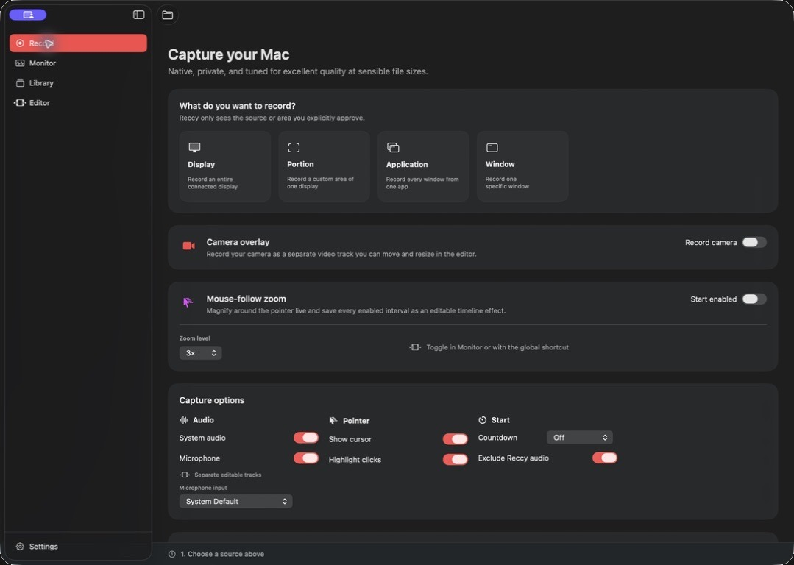
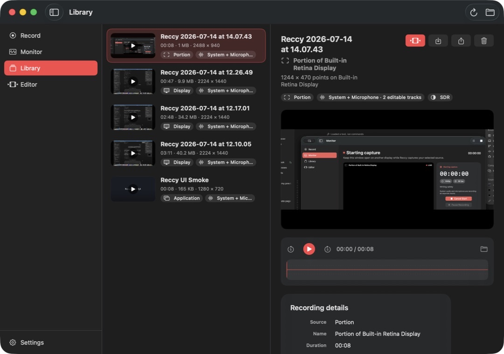
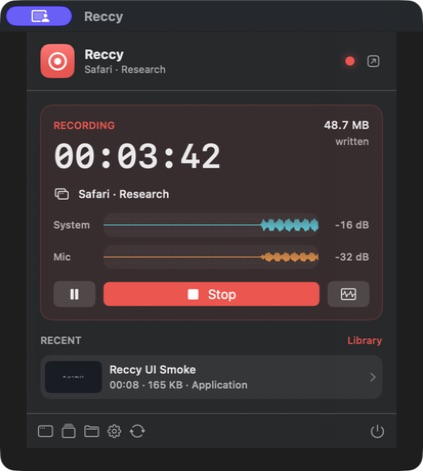
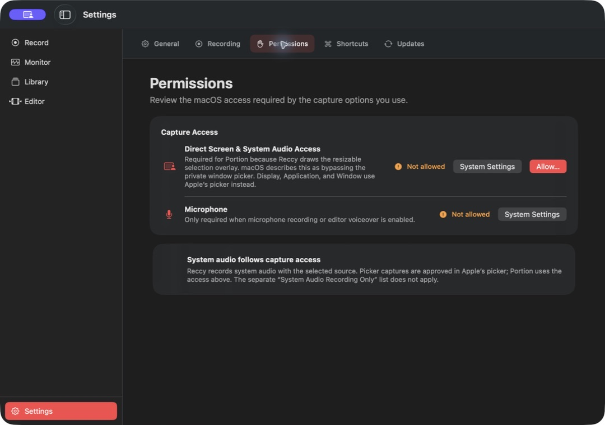

# Reccy

Reccy is a native screen recorder and non-destructive multitrack editor for macOS 26. It combines ScreenCaptureKit capture, separate system and microphone audio, live monitoring, a first-class timeline, compact exports, and fast menu-bar controls in one focused Mac app.



## Capture the right thing

Choose an entire display, every window from one application, or one specific window through Apple's private system picker. Portion capture uses a direct QuickTime-style overlay across connected displays. Reccy keeps the approved source obvious in the workspace and draws a local capture boundary that never appears in the recorded video.

- Record system audio and a chosen microphone as separate editable tracks.
- Monitor the live picture, elapsed time, file size, and detailed audio levels from another display.
- Show or hide the pointer, highlight clicks, exclude Reccy's audio, and pause without leaving dead time in the result.
- Capture native resolution or cap output at 4K, 1440p, 1080p, or 720p without upscaling smaller sources.
- Choose 24, 30, or 60 fps and efficient HEVC, compatible H.264, or editing-oriented MOV capture.
- Record HDR10 or save native HEIC, JPEG, and PNG screenshots in SDR or HDR.
- Preflight free space from the selected capture bitrate, preserve a runtime filesystem reserve, and recover playable fragmented recordings after interruption.

## Edit without flattening the recording


Reccy's `.reccyproject` package is a non-destructive edit decision list. Screen video, system audio, microphone audio, and voiceover takes stay independently movable, trimmable, splittable, mutable, and removable.

- Click or drag the ruler to seek; drag clips to move them with live preview updates.
- Reorder clips magnetically, snap to useful boundaries, or link matching audio and video when desired.
- Trim either edge, split one clip, split every lane, delete independently, or close time across the project.
- Record voiceover at the playhead with an explicit input-device picker.
- Read detailed cached waveforms for recorded audio, timeline clips, live monitoring, and library playback.
- Select each empty video segment independently and render it as black, the previous held frame, or the next held frame.

## A useful recording library



The Library combines a compact recording browser with a native preview, waveform scrubber, source and application metadata, audio-track details, resolution, frame rate, codec, dynamic range, pointer settings, and direct Edit, Export, Share, Reveal, and Trash actions.

Delivery presets cover the common cases without turning export into a codec control panel:

| Goal | Presets |
| --- | --- |
| Small, high-quality delivery | HEVC at source resolution, 4K, or 1080p |
| Broad compatibility | H.264 at source resolution, 4K, 1080p, or 720p |
| Professional finishing | Apple ProRes 422 or ProRes 4444 |
| Audio handoff | AAC audio-only M4A |

## Native controls everywhere

<table>
  <tr>
    <td width="48%"></td>
    <td width="52%"></td>
  </tr>
  <tr>
    <td><strong>Menu bar</strong><br>Start a source-aware capture, monitor timer, file size, and separate audio levels, pause or stop, open Monitor, and return to recent recordings.</td>
    <td><strong>Settings</strong><br>Manage capture defaults, storage, permissions, global shortcuts, tooltips, launch at login, completion behavior, and signed automatic updates.</td>
  </tr>
</table>

Reccy uses native SwiftUI toolbars, menus, settings, materials, SF Symbols, AppKit panels, AVKit playback, and a rich `MenuBarExtra`. Global recording shortcuts use [KeyboardShortcuts](https://github.com/sindresorhus/KeyboardShortcuts) without requiring Accessibility permission. Updates use [Sparkle](https://sparkle-project.org/) with EdDSA-signed archives and a phased GitHub Releases appcast.

## Architecture

Reccy intentionally targets macOS 26 only. There are no availability branches or compatibility UI paths in the product.

| Layer | Technology |
| --- | --- |
| Source approval | `SCContentSharingPicker`; direct multi-display portion overlay; `SCContentFilter` |
| Capture | `SCStream` video, system-audio, and microphone sample buffers |
| Recording | `AVAssetWriter`, AAC, HEVC/H.264, VideoToolbox color metadata |
| Live monitor | Coalesced zero-copy IOSurface preview from the existing capture buffers |
| Timeline | Serializable project model materialized as `AVMutableComposition` |
| Playback and export | AVKit, `AVAudioMix`, and `AVAssetExportSession` |
| Waveforms | Shared Reccy rendering backed by [DSWaveformImage](https://github.com/dmrschmidt/DSWaveformImage) |
| Distribution | Universal hardened runtime, Developer ID, notarization, Sparkle 2 |

The custom writer is deliberate: ScreenCaptureKit's convenient single-file recording path does not provide the track-level control Reccy needs to keep system audio and microphone audio independently editable. Read [Documentation/ARCHITECTURE.md](Documentation/ARCHITECTURE.md) for the media pipeline, project format, privacy boundary, and engineering decisions.

## Build and verify

Requirements:

- macOS 26 or later
- Xcode 26.5 or later
- Swift 6 with complete strict-concurrency checking

Open `Reccy.xcodeproj`, select the Reccy scheme, and run on **My Mac**. The repository's CI-equivalent verification builds Debug, runs the automated suite, validates configuration and scripts, and builds Release:

```sh
Scripts/verify-ci.sh
```

The current suite exercises resolution policy, portrait and Retina sources, independent and linked movement, magnetic reorder, snapping, trimming, split and ripple operations, pause-time removal, track-specific waveforms, persistent per-gap fill choices, held-frame composition, manifests, bitrate-aware storage policy, and interrupted-file recovery. Installed-app Computer Use QA covers every workspace plus the real Library transport and timeline interactions.

### Permission identity matters

macOS privacy grants are tied to the installed app's signing identity. Ad-hoc development builds are suitable for compilation, unit tests, and interface QA, but rebuilding them can invalidate Screen & System Audio Recording or Microphone grants. Reliable end-to-end capture testing requires a stable Apple Development or Developer ID signature.

After adding an Apple Account and Apple Development certificate in Xcode, use the guarded development installer:

```sh
Scripts/install-development.sh
```

It automatically selects an Apple Development or Developer ID identity, verifies the team identifier, refuses accidental ad-hoc installation, prevents replacing an install from a different team, and installs to `/Applications/Reccy.app`. Grant capture permissions once after the first stable-signed install; later local builds and signed Sparkle updates retain the same app identity. This machine currently has no valid signing identity, so end-to-end TCC persistence requires that one-time Xcode account setup.

## Release

Release automation builds a universal app, imports an ephemeral signing identity, enables Hardened Runtime, notarizes and staples the bundle, signs the Sparkle archive, verifies the appcast and Gatekeeper result, and publishes a tagged GitHub release. See [Documentation/RELEASING.md](Documentation/RELEASING.md) for required secrets and the local release procedure.

## Privacy

Capture, editing, projects, thumbnails, and exports stay on the Mac. Reccy only receives the display, application, window, or region approved through macOS. Its only network surface is the signed Sparkle update feed.

## Status

Reccy is in active development at version 0.1.0. The core capture, monitoring, library, editing, export, settings, menu-bar, update, storage-reserve, and interrupted-recovery architectures are implemented. External release acceptance still requires the signed hardware capture matrix, long-duration A/V drift tests, HDR validation, VoiceOver/keyboard QA, and Intel plus Apple-silicon export coverage.
